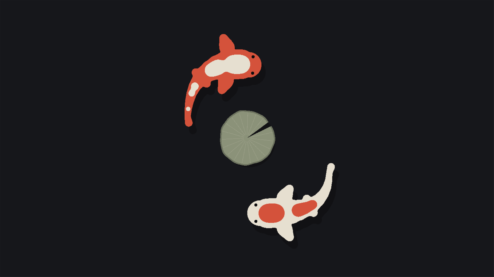

# Koi Screensaver

Two theme-coloured koi screensaver scenes for Omarchy. The Omarchy wordmark breaks into pieces that become swimming koi. Choose a quiet **Pond** or two koi circling a lily pad in **Koi chase**.

**Pond** — koi drifting between lily pads.


**Koi chase** — two koi circling a lily pad.



## Install

```sh
omarchy plugin add https://github.com/ejuro/koi-screensaver.git --enable
```

Koi replaces Omarchy's default screensaver only while the plugin is enabled and **Use as screensaver** is on (the default). Turning that switch off or disabling/removing the plugin restores the default saver, unless you had disabled it yourself. **Locking and authentication remain Omarchy's responsibility.**

Requires Omarchy's Quickshell shell and Ghostty, Alacritty, foot or kitty. Tested with Omarchy 4.0.4 and Ghostty 1.3.1 on x86_64; other terminals and the included aarch64 build have not been runtime-tested.

## Use

Click the fish in the bar to enable or disable idle activation, choose a scene, select **Balanced** or **Smooth** motion, or preview. Right-click toggles idle activation. Any key or mouse movement dismisses the preview.

Koi follows Omarchy's idle timeout and stay-awake setting. Settings live in its entry in `~/.config/omarchy/shell.json`.

## Update

```sh
omarchy plugin update io.github.ejuro.koi-screensaver
```

## Remove

```sh
omarchy plugin remove io.github.ejuro.koi-screensaver
```

Removing the plugin restores Omarchy's default screensaver, unless you had disabled it yourself.

<details>
<summary>Troubleshooting removal</summary>

Ownership records remain in `${XDG_STATE_HOME:-$HOME/.local/state}/koi-screensaver/`; you can delete that folder after removal.

After a crash, removal may leave the stock screensaver disabled. If you want it enabled, remove a leftover `~/.local/state/omarchy/toggles/screensaver-off`. Keep it if you deliberately disabled the stock saver. If the cursor remains hidden:

```sh
hyprctl eval 'hl.config({ cursor = { invisible = false } })' || hyprctl keyword cursor:invisible false
```

</details>

[MIT License](LICENSE) · [Third-party notices](THIRD_PARTY_NOTICES) · [Security](SECURITY.md)
