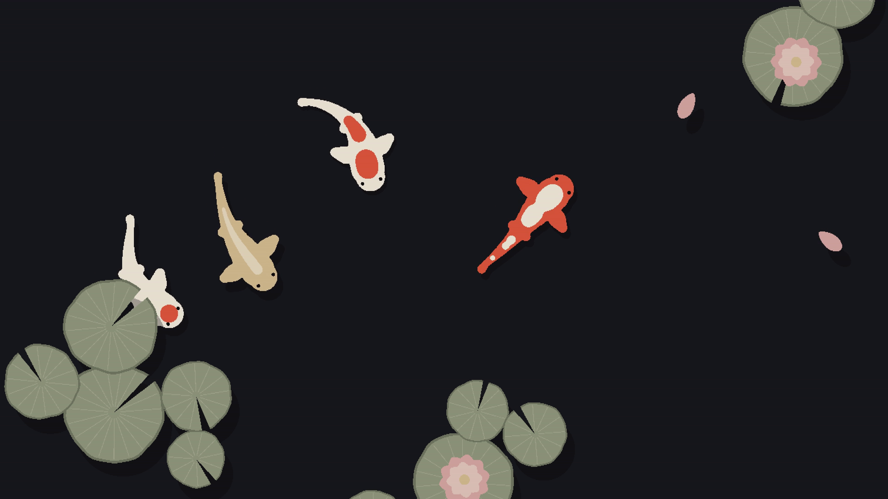

# Koi Screensaver

Koi as your Omarchy screensaver. It opens with the Omarchy wordmark floating on the water, until each letter breaks apart and gathers itself into a koi that swims away, either into a quiet pond or into a slow chase round a lily pad.

Everything is coloured from your current Omarchy theme, so the koi match your desktop: ink koi on rice paper under a light theme, pale koi in dark water under a dark one.



## Scenes

Pick one in the drawer; both open with the wordmark.

- **Koi chase**: two koi, red and ink, circling a single lily pad in still water, always the same distance apart. Now and then one flicks its tail and leaves a little swirl in the water, and faint ripples spread round the pad.
- **Pond** (above): five koi drift under still lily pads and water lilies, past a few floating petals, casting soft shadows on the pond floor and on each other.

## Install

```sh
omarchy plugin add https://github.com/ejuro/koi-screensaver.git --enable
```

That's all. From then on the koi appear instead of Omarchy's screensaver whenever you've been idle long enough.

## Use

- **Click the fish** in the bar for its drawer:
  - **Use as screensaver**: whether the koi appear by themselves when you're idle, instead of Omarchy's screensaver.
  - **Scene**: Koi chase or Pond.
  - **Motion**: *Balanced*, as light as Omarchy's own screensaver, or *Smooth*, more frames a second for more CPU.
  - **Preview**: see them now. Any key or mouse movement closes it.
- **Right-click the fish** to flip *Use as screensaver* without opening the drawer. The fish is faded while it's off.
- In the drawer, the arrow keys move between the rows, Enter picks, Space flips the switch and `p` previews.
- From anywhere: `omarchy-shell koi-screensaver start`, or `enable` / `disable` / `toggle` / `status`, `omarchy-shell koi-screensaver scene chase` (or `pond`), and `omarchy-shell koi-screensaver motion smooth` (or `balanced`).

To open it from **Super + Escape → System → Screensaver** as well, add this line to `~/.config/omarchy/extensions/omarchy-menu.jsonc`, inside the braces. The icon and label have to be repeated, or the menu row loses them:

```jsonc
"system.screensaver": {"icon":"󱄄","label":"Screensaver","action":"omarchy-shell koi-screensaver start"},
```

## Configure

Everything in the drawer is also in Omarchy's own settings for the widget, and is kept, as Omarchy keeps every plugin's settings, inline on the plugin's entry in `~/.config/omarchy/shell.json`:

```json
{ "id": "io.github.ejuro.koi-screensaver", "onIdle": true, "scene": "chase", "motion": "balanced" }
```

The idle timeout is Omarchy's own (`idle.screensaver`). A few environment variables override the rest, mostly for trying things out: `KOI_SCREENSAVER_SCENE`, `KOI_SCREENSAVER_MOTION`, `KOI_SCREENSAVER_FPS`, `KOI_SCREENSAVER_FONT_SIZE` (see Requirements) and `KOI_SCREENSAVER_COLORS` (a `colors.toml` to use instead of the current theme's).

## How it fits in

Omarchy stays in charge of idling. Your idle timeout (`idle.screensaver` in `shell.json`), stay-awake, video playback keeping the screen on, and locking all keep working as before. The plugin only swaps what appears:

- While *Use as screensaver* is on, Omarchy's own screensaver is switched off, using Omarchy's own setting for that. Disabling or removing the plugin switches it back on. If you had already switched Omarchy's screensaver off yourself, it stays off.
- The koi appear one second after Omarchy's screensaver would have, in a window Omarchy recognises as its screensaver. So the lock screen still follows on time, and closing it counts as you coming back.

## What it runs and touches

Like every Omarchy plugin it runs unsandboxed, as you. It never uses sudo or the network, and installs nothing outside its own folder.

- **The plugin** (`Service.qml`, `Panel.qml`) runs the launcher when you're idle or ask for a preview, and writes its settings to its own entry in `shell.json`. While *Use as screensaver* is on, it sets Omarchy's own "screensaver off" switch (`~/.local/state/omarchy/toggles/screensaver-off`), and keeps a note that it did so in `~/.local/state/koi-screensaver/`, so it only ever undoes its own change.
- **The launcher** (`bin/koi-screensaver`) opens your terminal fullscreen on each monitor through `hyprctl`, with Omarchy's screensaver window class, the same way Omarchy opens its own screensaver. It uses `jq`, `socat` and `xdg-terminal-exec`, which Omarchy already has.
- **The screensaver** (`bin/koi-screensaver-<arch>`, built from [`src/`](src)) reads the theme's `colors.toml` and Omarchy's wordmark, hides the mouse pointer while it's up, and on closing closes every screensaver window, as Omarchy's does. It writes one line to `~/.local/state/koi-screensaver.log` each time it closes, saying only whether a key, the mouse or something else woke it.

## Performance

It only sends the parts of the screen that changed, and the frame rate is always a whole fraction of your monitor's refresh rate, so every frame lasts the same time and the koi move evenly. *Balanced* takes as many frames as fit under 18 a second (17.1 at 120 Hz, 18 at 144 Hz, 15 at 60 Hz); *Smooth* takes about 20 (20 at 60 and 120 Hz).

Measured on a 4K, 120 Hz screen with Ghostty, terminal included, against Omarchy's own screensaver on the same machine:

| | CPU (one core = 100%) |
|---|---|
| Omarchy's screensaver | 58–65%, depending on the effect it plays |
| Koi chase, Balanced | 65% |
| Pond, Balanced | 67% |
| Either scene, Smooth | 70% |

On Balanced, both scenes cost about the same as Omarchy's screensaver. A larger font (see below) or a lower frame rate (`KOI_SCREENSAVER_FPS`) makes them cheaper still. It runs only while it's on screen.

## Requirements

Omarchy with its shell, and Ghostty, Alacritty or foot as your terminal. kitty is supported too but hasn't been tested yet. Ready-built programs for x86_64 and aarch64 are included, so nothing has to be compiled.

The koi are drawn with Unicode sextant characters in a terminal at font size 4.5, which is much finer than Omarchy's screensaver uses. To change that, set `KOI_SCREENSAVER_FONT_SIZE` in your environment.

## Building

The screensaver itself is a small Go program in [`src/`](src), with no dependencies beyond `golang.org/x/sys`. `./build.sh` rebuilds both binaries in `bin/`, and the build is reproducible: with Go 1.27.1 it gives the shipped binaries byte for byte, so you can check them with `./build.sh && git diff --stat bin/`. To try it in any terminal, run `bin/koi-screensaver-x86_64`; any key quits. Add `-scene chase` for the koi chase, and `-intro=false` to skip the wordmark. `go test ./...` in `src/` checks that drawing only what changed matches drawing everything.

## Update and remove

```sh
omarchy plugin update io.github.ejuro.koi-screensaver
omarchy plugin remove io.github.ejuro.koi-screensaver
```

Removing it takes its entry out of `shell.json` and switches Omarchy's own screensaver back on (unless you had switched it off yourself). The only things left are an empty `~/.local/state/koi-screensaver/` folder and the small log; delete them if you like:

```sh
rm -rf ~/.local/state/koi-screensaver ~/.local/state/koi-screensaver.log
```

MIT License.
